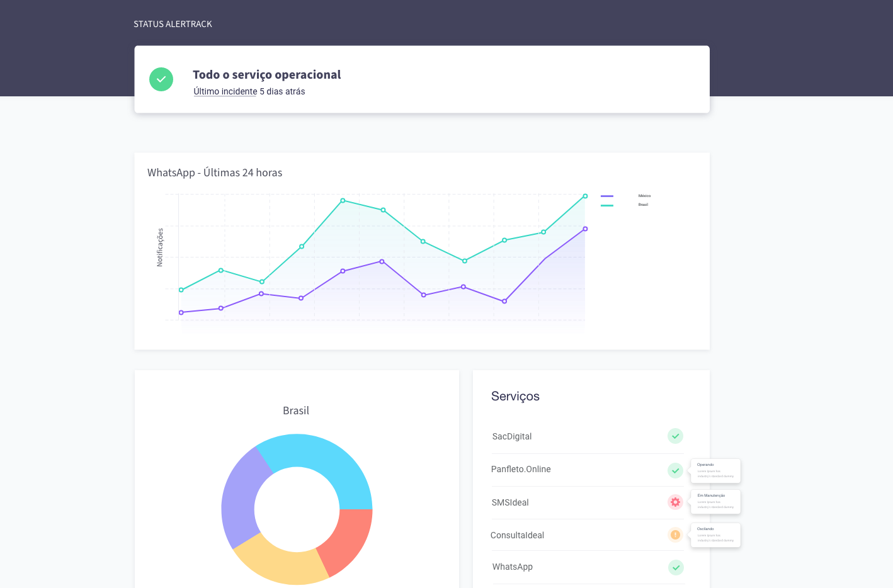

# Desafio Front-end: Landpage Status de Serviço

### Sobre o desafio

Seu objetivo é criar uma landpage, seguindo o layout definido. Esta página tem como propósito registrar os incidentes, status e exibir a disponibilidade dos produtos comercializados pela empresa. 

Reservamos uma área para exibir em formato de gráfico os problemas reportados pelos usuários do WhatsApp em todo mundo!

### O que esperamos?

* Siga o padrão do wireframe (**wireframe.xd**) desenvolvido no **Adobe XD**
* Utilizar HMLT5 / CSS3
* Utilizar bibliotecas JS que auxiliem na construção dos componentes
* Uso de gráficos: https://www.amcharts.com/, https://www.highcharts.com/

### Diferenciais?

* Utilizar o Wordpress (Criação de templates)
* Persistencia de dados (Banco de dados)
* Uso de frameworks como (React, AngularJS, VueJS, Bootstrap, AlpineJS)
* Sasss / Less

### Como entregar?

* Encaminhe o link do seu repositório for para **desenvolvimento@alertrack.com.br** com o assundo **Vaga Front-End**

Good Luck!
