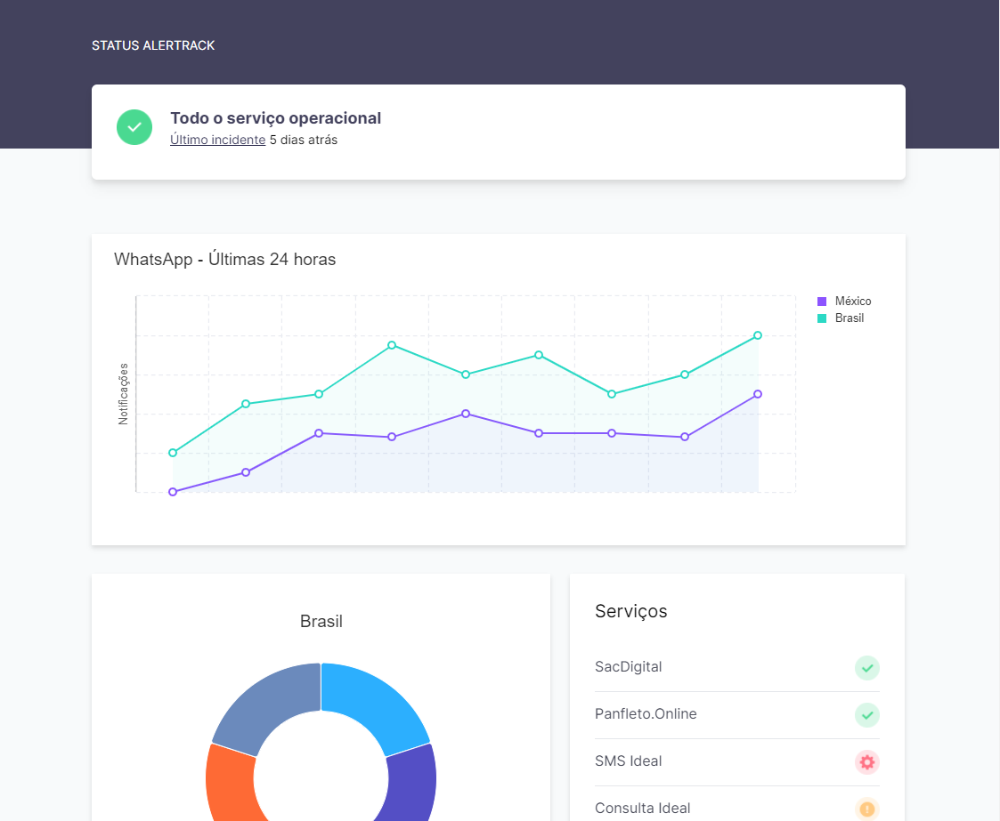

## Desafio Front-end: Landpage Status de Serviço

### Sobre o desafio

O objetivo do desafio era criar uma LandPage de Status para informar os usuários sobre a o WhatsApp

Foi separado uma área para exibir em formato de gráfico os problemas reportados pelos usuários do WhatsApp em todo mundo!

Confira o projeto através do [Link](https://status-page-beige.vercel.app/)

### Tecnologias usadasa

* React
* Tailwindcss
* [Highcharts](https://www.highcharts.com/)

### Diferenciais

* Simulação de dados em tempo real (Gráfico com dados dinâmicos)
* Layout Responsivo (Mobile First)
